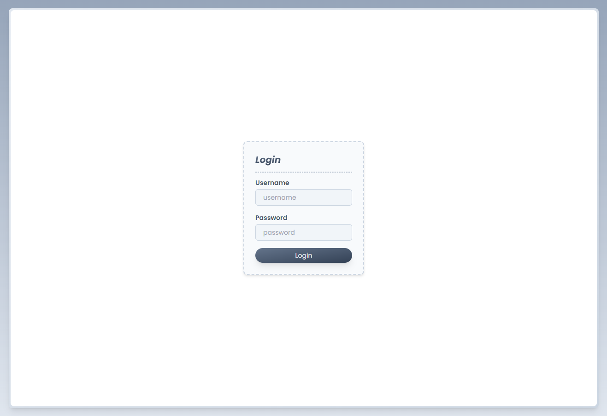
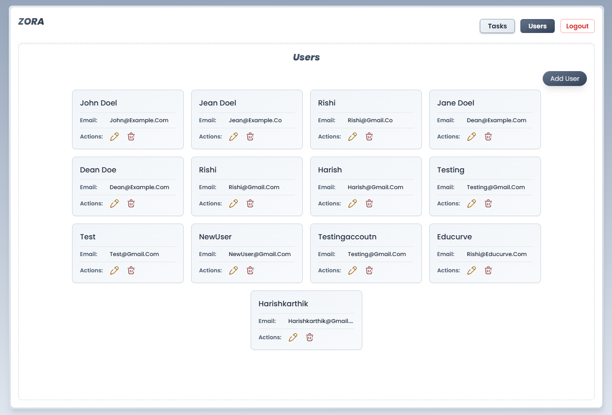
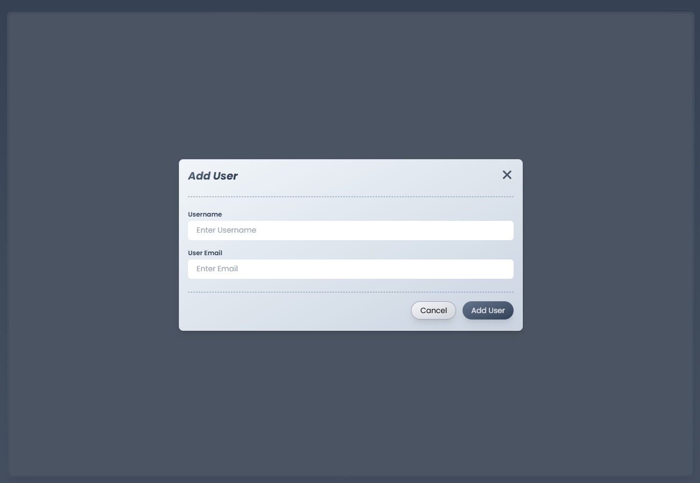
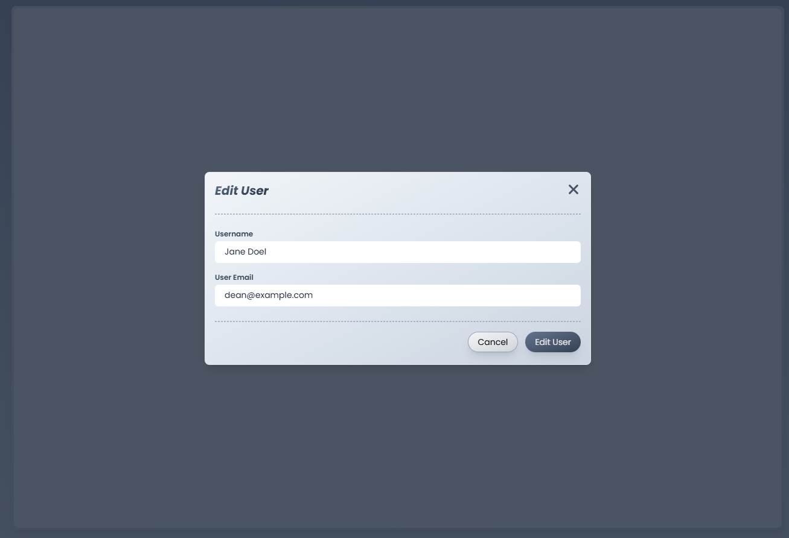
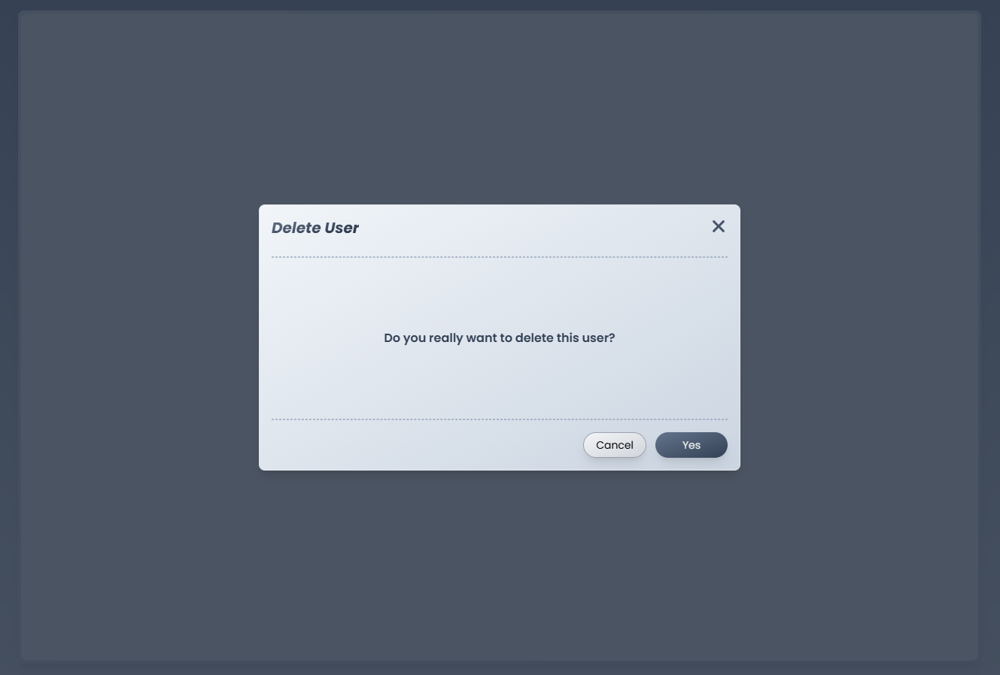
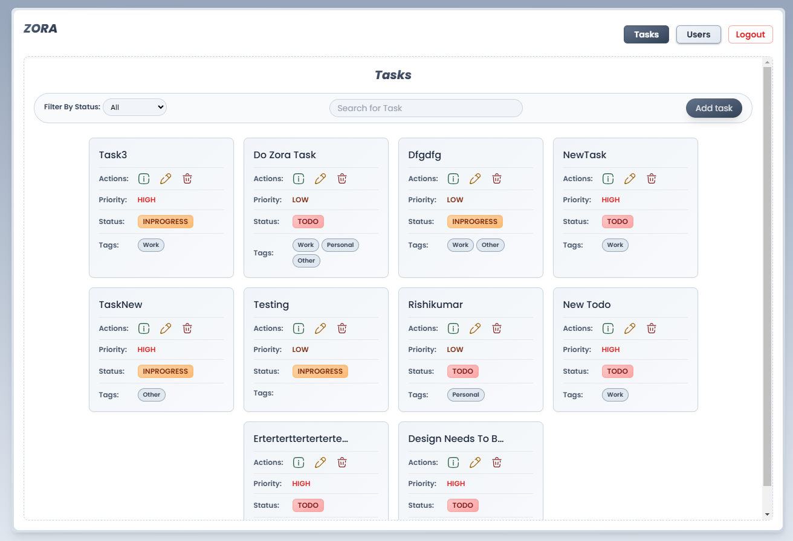
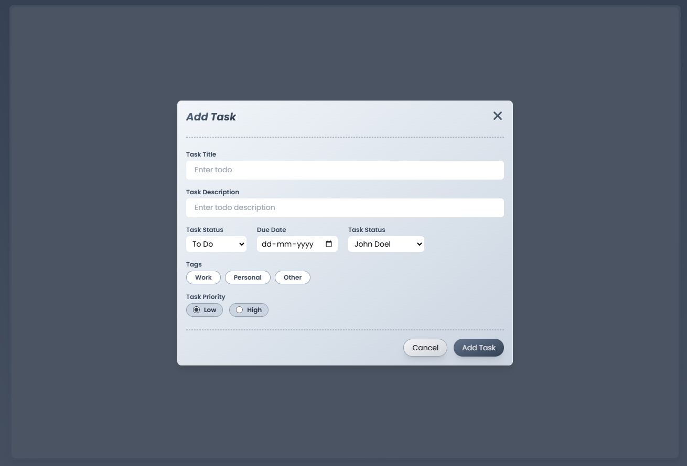
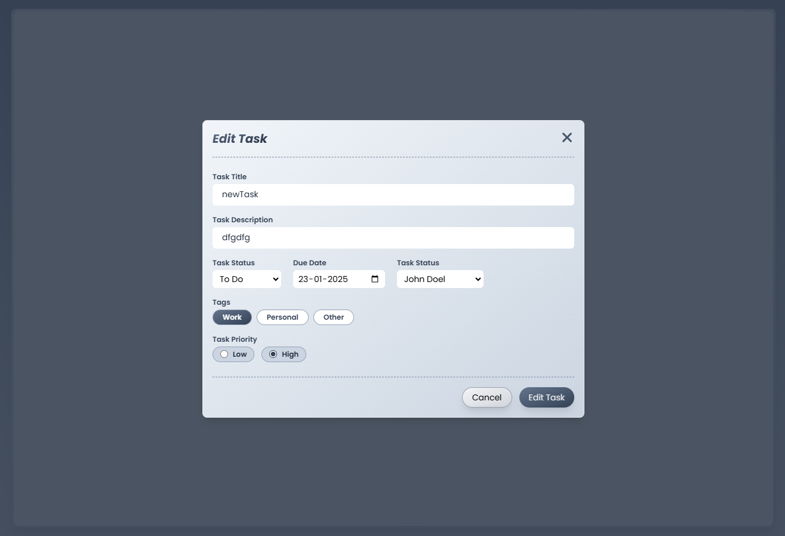
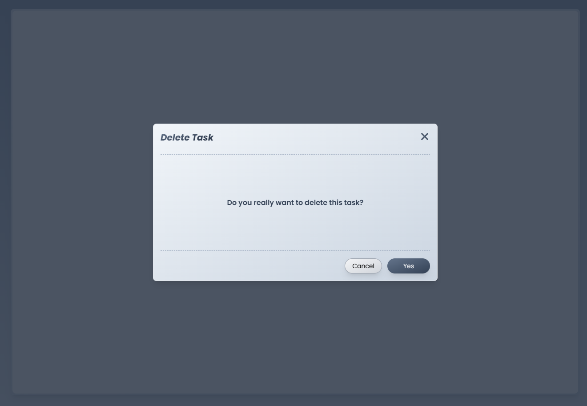

# ZORA

ZORA is a **Task Management Application** built with **React**, **TypeScript**, and **Tailwind CSS**. The application provides features for managing users and tasks, including filtering tasks by status. Routing is handled using **React Router**.

---

## Features

### User Management
- **View Users** (`/users`)
- **Add User** (`/users/add`)
- **Edit User** (`/users/edit/:id`)
- **Delete User** (`/users/delete/:id`)

### Task Management
- **View Tasks** (`/tasks`)
  - Tasks can be filtered by their status: `Todo`, `In Progress`, and `Done`.
- **Add Task** (`/tasks/add`)
- **Edit Task** (`/tasks/edit/:id`)
- **Delete Task** (`/tasks/delete/:id`)

### Authentication
- **Login** (`/login`): A basic login page for accessing the application.

---

## Tech Stack

- **Frontend**: React, TypeScript
- **Styling**: Tailwind CSS
- **Routing**: React Router
- **State Management**: React Hooks (e.g., `useState`, `useEffect`, `useRef` etc..)

---

## Implementation Details

### Tasks Page
- Includes a **filter by status** functionality to view tasks categorized as:
  - `Todo`
  - `In Progress`
  - `Done`
- Implements a **debounced search** feature to dynamically search for tasks without excessive re-renders.

---

## Images

### Application Screenshots
Below are screenshots of various application pages:

#### Login Page


#### Users Page


#### Add User


#### Edit User


#### Delete User


#### Tasks Page


#### Add Task


#### Edit Task


#### Delete Task


---

## Installation

1. Clone the repository:
   ```bash
   git clone https://github.com/your-repo.git
